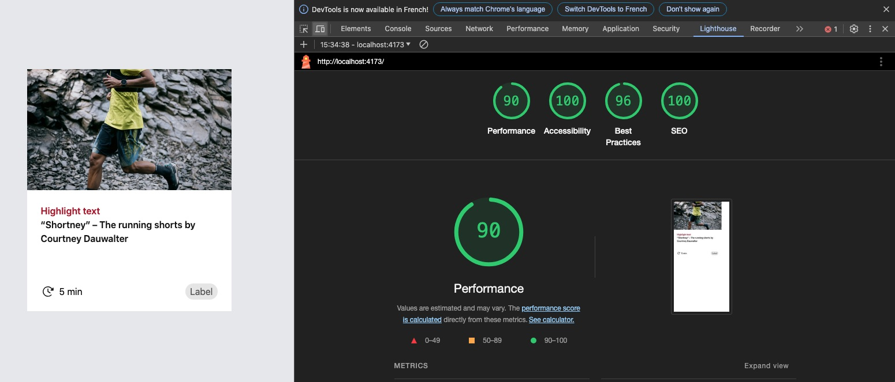

# Design System Integration Test

### Here is what I did to create the test component
My goal was to have a pixel-perfect component that was performant and respected SEO and accessibility standards.

- I started by deploying the suggested boilerplate.
- I used TypeScript to ensure data type safety.
- I added "sass" as a dev dependency to manage my stylesheet.
- I  created a data mock of the product.
- I used a separate stylesheet for the component because:
  - It results in a lighter and more readable JSX.
  - It prevents code repetition.
  - It's easier to maintain.
  - It's easier to debug.

## Splitting code

As we are creating a component for the design system, I split the main component `ProductCard into multiple reusable components:

- Title
- Text
- Label

## I added unit tests using Vitest and Testing Library

- I checked if props were used and displayed correctly and did a snapshot of the component and its variations.

## Side note

- I would have challenged the designer for using sizes that are not multiples of 4, as it goes against the Tailwind mindset. For example, a width of 4 (w-4) = 16px. The designer may have used a width of 352px or 356px instead of 354px.
